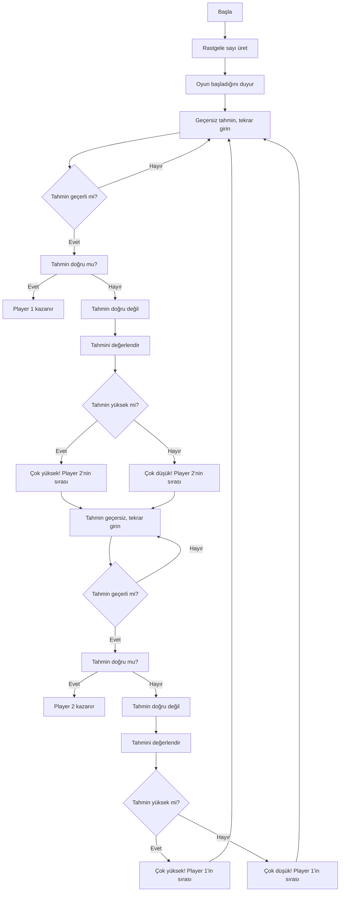

# cppNumberDirection

## Şema

```mermaid
flowchart TD
    A[Başla] --> B[Rastgele sayı üret]
    B --> C[Oyun başladığını duyur]
    
    C --> D[Player 1'in tahminini al]
    D --> E{Tahmin geçerli mi?}
    
    E -- Hayır --> D[Geçersiz tahmin, tekrar girin]
    E -- Evet --> F[Tahmin doğru mu?]
    
    F -- Evet --> G[Player 1 kazanır]
    F -- Hayır --> H[Tahmin doğru değil]
    
    H --> I[Tahmini değerlendir]
    I --> J{Tahmin yüksek mi?}
    
    J -- Evet --> K[Çok yüksek! Player 2'nin sırası]
    J -- Hayır --> L[Çok düşük! Player 2'nin sırası]
    
    K --> M[Player 2'nin tahminini al]
    L --> M[Player 2'nin tahminini al]
    
    M --> N{Tahmin geçerli mi?}
    
    N -- Hayır --> M[Tahmin geçersiz, tekrar girin]
    N -- Evet --> O[Tahmin doğru mu?]
    
    O -- Evet --> P[Player 2 kazanır]
    O -- Hayır --> Q[Tahmin doğru değil]
    
    Q --> R[Tahmini değerlendir]
    R --> S{Tahmin yüksek mi?}
    
    S -- Evet --> T[Çok yüksek! Player 1'in sırası]
    S -- Hayır --> U[Çok düşük! Player 1'in sırası]
    
    T --> D
    U --> D

```
